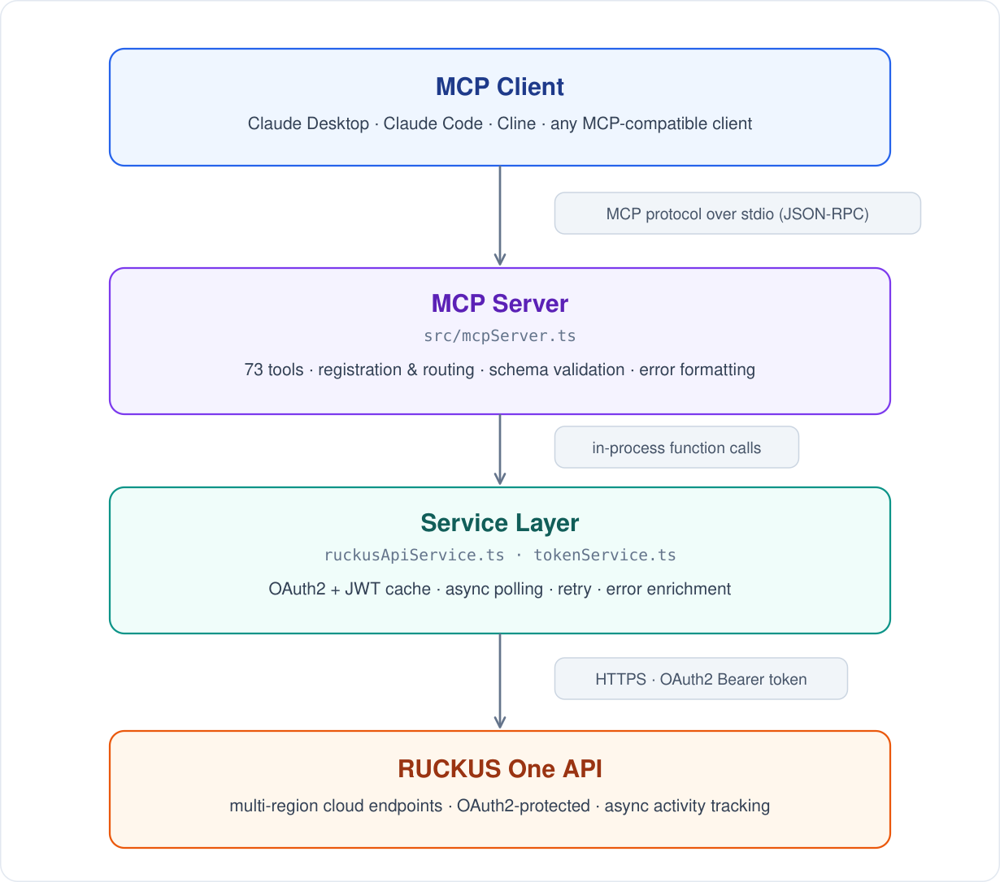
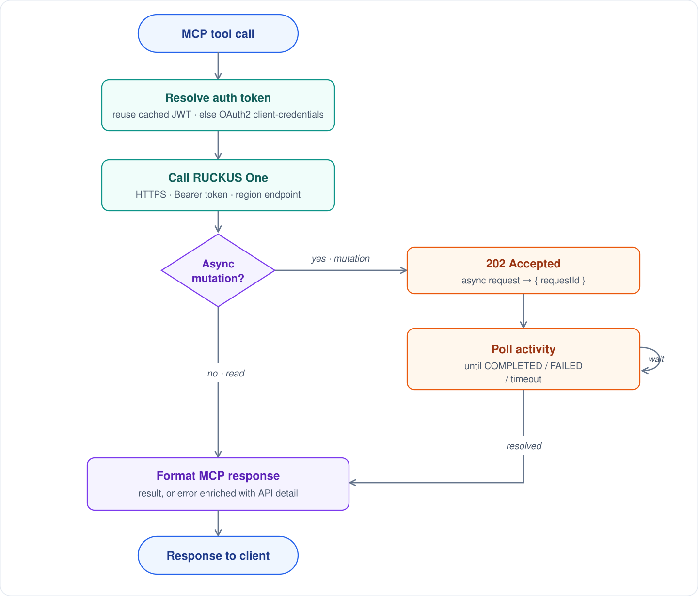
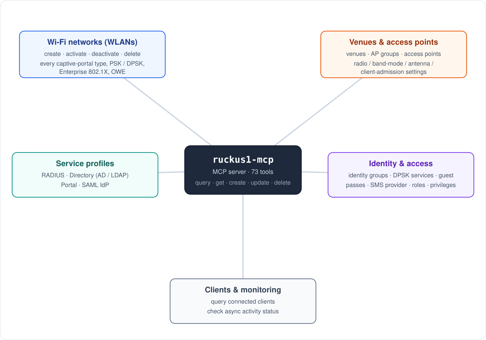
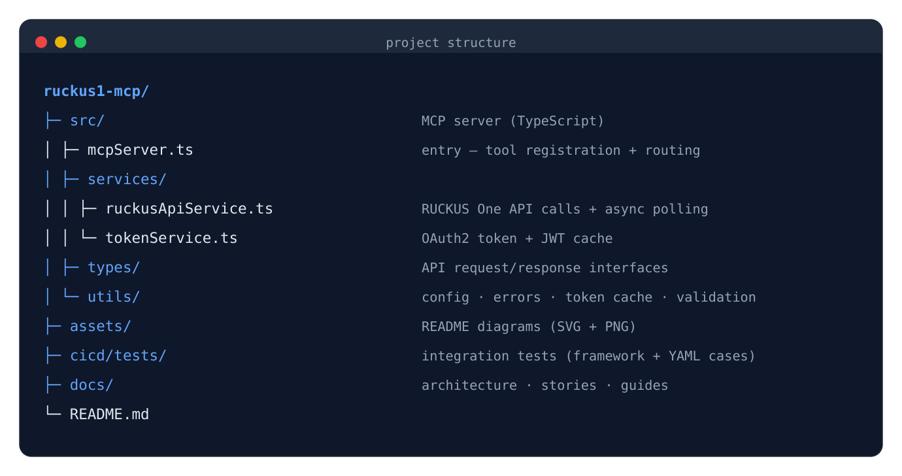

<h1 align="center">ruckus1-mcp</h1>

<p align="center">
  <em>Manage a <strong>RUCKUS One</strong> network from any MCP-compatible AI assistant —<br/>
  venues, Wi-Fi, access points, and the RADIUS / LDAP / portal / SAML profiles behind them.</em>
</p>

<p align="center">
  <a href="https://github.com/dogkeeper886/ruckus1-mcp/releases"></a>
  <a href="https://hub.docker.com/r/dogkeeper886/ruckus1-mcp"></a>
  <a href="https://hub.docker.com/r/dogkeeper886/ruckus1-mcp"></a>
  <a href="LICENSE"></a>
</p>

A [Model Context Protocol](https://modelcontextprotocol.io) (MCP) server for **RUCKUS One**. It gives
MCP-compatible AI assistants — Claude Desktop, Claude Code, Cline, and others — a standardized set of
tools to manage a RUCKUS One tenant, so an agent can stand up a venue, a Wi-Fi network, and the
profiles it depends on without touching the GUI.

It is a **stdio** server: no HTTP port, no daemon. Your MCP client launches it on demand and talks to
it over stdin/stdout.

<p align="center">
  <picture>
    <source srcset="assets/architecture.svg" type="image/svg+xml"/>
    
  </picture>
</p>

## Features

- **MCP-only** — stdio transport; no REST API, Express, or HTTP endpoints.
- **73 tools** with a uniform `query` / `get` / `create` / `update` / `delete` shape per resource, plus consolidated polling for asynchronous operations.
- **OAuth2** client-credentials authentication with JWT caching.
- **Simple configuration** — every credential supplied through environment variables.

## Quick Start

### Prerequisites

- RUCKUS One API credentials (tenant ID, client ID, client secret)
- An MCP client (Claude Desktop, Claude Code, Cline, or any MCP-compatible client)
- Docker (recommended), or Node.js 18+ to run from source

### Option 1 — Docker (recommended)

Use the published image — no build required.

**Claude Code (CLI):**

```bash
claude mcp add ruckus1 -- docker run --rm -i \
  -e RUCKUS_TENANT_ID=your-tenant-id \
  -e RUCKUS_CLIENT_ID=your-client-id \
  -e RUCKUS_CLIENT_SECRET=your-client-secret \
  -e RUCKUS_REGION=your-region \
  dogkeeper886/ruckus1-mcp:latest
```

**Other MCP clients (`mcp.json`):**

```json
{
  "mcpServers": {
    "ruckus1": {
      "command": "docker",
      "args": [
        "run", "--rm", "-i",
        "-e", "RUCKUS_TENANT_ID=your-tenant-id",
        "-e", "RUCKUS_CLIENT_ID=your-client-id",
        "-e", "RUCKUS_CLIENT_SECRET=your-client-secret",
        "-e", "RUCKUS_REGION=your-region",
        "dogkeeper886/ruckus1-mcp:latest"
      ]
    }
  }
}
```

`--rm` removes the container on exit; `-i` keeps stdin open for the MCP stream.

### Option 2 — Run from source

```bash
git clone https://github.com/dogkeeper886/ruckus1-mcp.git
cd ruckus1-mcp
npm install
npm run build
```

Then point your MCP client at the built server (`mcp.json`):

```json
{
  "mcpServers": {
    "ruckus1": {
      "command": "node",
      "args": ["/absolute/path/to/ruckus1-mcp/dist/mcpServer.js"],
      "env": {
        "RUCKUS_TENANT_ID": "your-tenant-id",
        "RUCKUS_CLIENT_ID": "your-client-id",
        "RUCKUS_CLIENT_SECRET": "your-client-secret",
        "RUCKUS_REGION": "your-region"
      }
    }
  }
}
```

(Or run from TypeScript directly without building: `npm run mcp`.)

## Configuration

All configuration is via environment variables:

| Variable | Required | Description |
|----------|----------|-------------|
| `RUCKUS_TENANT_ID` | yes | RUCKUS One tenant ID |
| `RUCKUS_CLIENT_ID` | yes | OAuth2 client ID |
| `RUCKUS_CLIENT_SECRET` | yes | OAuth2 client secret |
| `RUCKUS_REGION` | no | Regional endpoint (e.g. a region code); leave unset for the global endpoint |

## How it works

Each tool call resolves an auth token (reusing a cached JWT, or fetching a new one via OAuth2
client-credentials), calls the RUCKUS One API over HTTPS, and formats the result for the client.
Read operations return immediately. Mutations are asynchronous: the API answers `202` with a
`requestId`, and the server polls the activity to completion before it replies — so the agent gets a
settled result, not a "submitted" placeholder.

<p align="center">
  <picture>
    <source srcset="assets/request-lifecycle.svg" type="image/svg+xml"/>
    
  </picture>
</p>

## Capabilities

Tools follow a uniform `query` / `get` / `create` / `update` / `delete` shape per resource, grouped
by area:

<p align="center">
  <picture>
    <source srcset="assets/resource-graph.svg" type="image/svg+xml"/>
    
  </picture>
</p>

- **Wi-Fi networks (WLANs)** — create / activate / deactivate / delete, including every captive-portal type: Click-Through, Self Sign-In (Email/SMS/WhatsApp OTP), Guest Pass, Host Approval, Cloudpath, WISPr, Directory (AD/LDAP), **SAML IdP**, and Workflow — plus PSK, DPSK, Enterprise 802.1X, and OWE.
- **Venues & access points** — venues, AP groups, access points, and their radio / band-mode / antenna / client-admission settings.
- **Service profiles** — RADIUS, Directory (AD/LDAP), Portal, and SAML IdP profiles.
- **Identity & access** — identity groups, DPSK services, guest passes, SMS provider (Twilio), roles, and privilege groups.
- **Clients & monitoring** — query connected clients; check async activity status.

Your MCP client lists every tool with its full input schema once connected; the registrations live in
[`src/mcpServer.ts`](src/mcpServer.ts).

## Project structure

<p align="center">
  <picture>
    <source srcset="assets/project-tree.svg" type="image/svg+xml"/>
    
  </picture>
</p>

## Development

```bash
npm run build              # compile TypeScript -> dist/
npm run mcp                # run from source (ts-node)
cd cicd/tests && npm test  # run the integration test suite
```

Inspect interactively with the MCP Inspector:

```bash
npx @modelcontextprotocol/inspector npx ts-node src/mcpServer.ts
```

See [`docs/`](docs/) for the architecture overview, design stories, and guides.

## Links

- **Docker image:** https://hub.docker.com/r/dogkeeper886/ruckus1-mcp
- **Releases / changelog:** https://github.com/dogkeeper886/ruckus1-mcp/releases

## License

[MIT](LICENSE)
